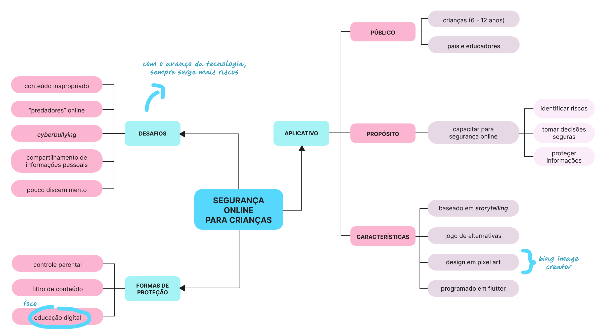
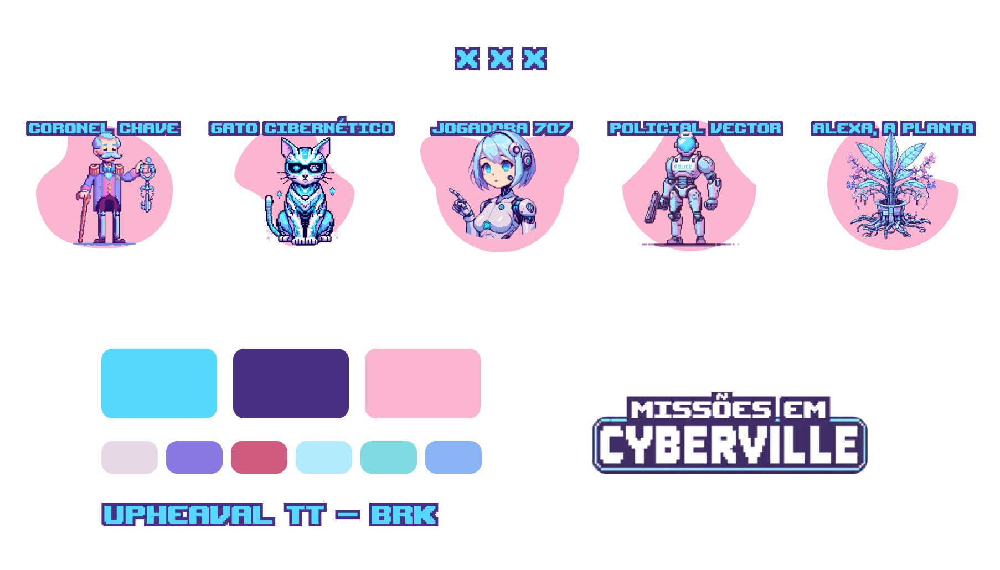

###### PT-BR

<h1>CyberVille: Segurança Online para Crianças</h1>

Este é um projeto de jogo mobile voltado para crianças entre 6 e 12 anos, com o objetivo de ensinar sobre segurança online de forma divertida e interativa. O jogo utiliza perguntas do tipo quiz para abordar diversos tópicos importantes relacionados à segurança online, incluindo:

<ul>
  <li>Uso seguro de senhas</li>
  <li>Privacidade no uso de aplicativos</li>
  <li>Comportamento em jogos online</li>
  <li>Importância da supervisão dos pais</li>
  <li>Fake news e obtenção de informações</li>
</ul>

<h2>Desenvolvimento</h2>

<section>
  <h3>Mapa Mental do Aplicativo</h3>
  

    
  

</section>

<section>
  <h3>Protótipos Iniciais</h3>
  

    
    
  

</section>

<section>
  <h3>Personagens e estilização</h3>
  

    
  

</section>

